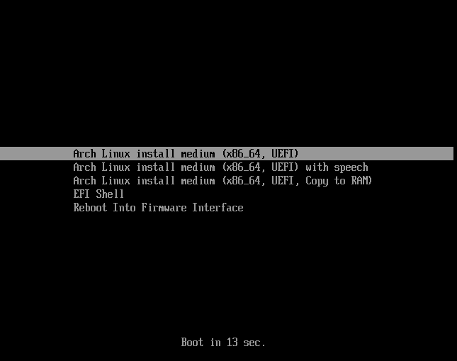
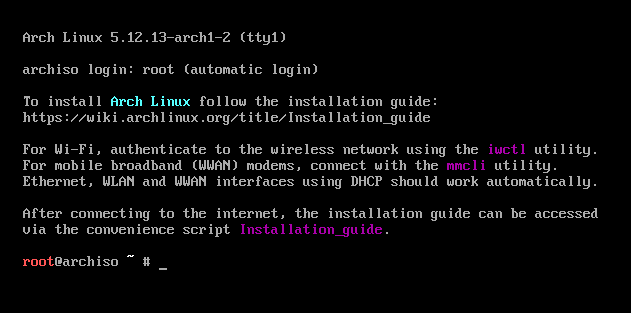
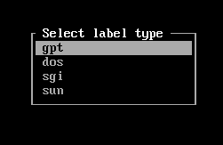
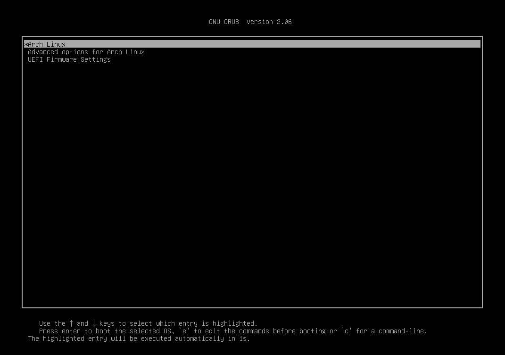

# Installing Arch Linux

_By_ [_Isaac_](../../../members/members/isaac.md)

Arch Linux is a "lightweight and flexible" Linux distribution that adheres to the KISS (keep it simple, stupid) principle of design. 

## Why Arch?

Arch's inherent customisability and lightweight design means it's the distro of choice for many users who like to have a lot of control over their operating system, the ability to choose exactly what packages you want, what desktop environment, services, and components, it's all up to you in Arch.

Not only do users have granular control over the operating system at pretty much all times, the packages found in the `pacman` manager are the most up to date versions of the packages available across essentially any Linux distribution. Arch adopts a rolling release model, which means that as soon as a new kernel or application version is rolled out publicly it is immediately available to Arch users, this contrasts with many other Linux flavours and non-Linux operating systems, who tend to release updates in one big go.[^1]

[^1]: the downside of this of course is that in some circumstances this approach sacrifices stability for the sake of being cutting edge, however downgrading packages to a stable version is possible in pacman

Arch's installation process is famously complex and unforgiving, however this comes with a much more in-depth knowledge of how Linux works, having to configure drive partitions and aspects of networking manually results in an understanding of Linux far greater than a standard distro installation will afford you, and a greater sense of accomplishment to boot!

If any part of the installation confuses or confounds you, a final pro of Arch (which actually is relevant to most distributions) is [the Arch Wiki](https://wiki.archlinux.org/), it's some of the best and most comprehensive documentation on any piece of software I have ever come across, this website will be absolutely invaluable to you.

## Installation

### In VM

I will be installing Arch in VMWare Workstation Pro 16, with the license that comes with being in Abertay Uni. The .`iso`, the file containing the required data for operating system installation, can be found [here](https://linuxconfig.org/arch-linux-download). In VMWare Arch comes under "Other Linux 5.x and later kernel 64-bit"[^2], I gave it 20GB disk space and 4GB RAM.

[^2]: As of July 2021

It's also of critical importance that the OS is booted in UEFI mode, otherwise later steps mightn't work (found this one out the hard way lol). To do this you right click the VM and go to `Settings>Options>Advanced>Firmware Type` and switch `BIOS` to `UEFI`.

A note: **DO NOT** skip anything in here, missing one thing early on can have bad results much later down the line which could end uip in you having to restart the whole procedure

### Opening Stage

On booting for the first time, you should see this screen:



hit enter or wait 15 seconds, you should then be presented with this screen (a bash shell):



Now we can begin entering commands!

First we need to verify that we're in UEFI mode (which we already switched to earlier), this can be done by running

```sh
ls /sys/firmware/efi/efivars
```

If a list of files is returned then we can move on to the next step, verifying network services.

The Arch installation environment should have already started network services for us, this is of great importance to us as there are some packages that we're going to need to install during this process, specifically a text editor, in order to continue. To verify this, run:

```sh
ping -c 4 www.linuxconfig.org
```

If that worked, we can now move on to setting the correct time by updating the system clock with:

```sh
timedatectl set-ntp true
```

### Drive Partition

To partition the drive we first need to run `lsblk` to verify the partitions currently present in the ISO. you should see a partition called `loop0`, one called `sr0`, and an extra one, most likely called `sda`, which is the size that was allocated earlier on (20GB in this case).

To begin creating the installation partitions, run

```sh
cfdisk /dev/sda
```

When the following window shows up, select GPT



You should now see a window containing a menu with single line containing the word `Free space`. This is the partition menu, we will be creating three partitions here:

1. `sda1`, which will be a `FAT32` formatted `EFI` partition, where the bootloader etc will be stored

2. `sda2`, which is going to be the `root` partition, where the userspace will be

3. `sda3`, a `swap` partition, a space on disk used when the RAM is at capacity

Hit enter on `Free space` (or new at the bottom), then type `500M` then hit the right arrow on your keyboard once to get to `Type`, where you can select the type of partition in a menu, `EFI System` is at the top

Go down and hit enter on Free space/New again, type `18.5G`, specifying the type isn't necessary here

Repeat the step 1 more time, type 1G (if needed), `Type` again, and select `Linux Swap`

Use the arrow keys to go to `Write` along the bottom, hit enter, type the word `yes`, and then `Quit` the program

you now have the three necessary partitions to continue, you can verify this by trying `lsblk` again and seeing all three `sdax` partitions available in the correct sizes

Now we must create the filesystems by entering the following commands:

```sh
mkswap /dev/sda3		# swap partition
swapon /dev/sda3

mkfs.ext4 /dev/sda2		# root partition

mkfs.fat -F32 /dev/sda1  # EFI partition
```

Next we mount the partitions (we don't need to mount swap)

```sh
mount /dev/sda2 /mnt	# root partition

mkdir /mnt/boot			# make dir for boot and mount
mount /dev/sda1 /mnt/boot
```

And there's the filesystem partition!

### Essential Package Installation

To install the essential packages required for the base Arch system, we enter

```sh
pacstrap /mnt base linux linux-firmware
```

This may take a few minutes, could be a good time to grab a drink lmao.

When that's finished we generate an `fstab` (file systems table) file using the following command so the system knows where to mount the partitions on boot

```sh
genfstab -U /mnt >> /mnt/etc/fstab
```

### System Customisation

Now the base is installed, we have to begin customising the system to our needs. Run

```sh
arch-chroot /mnt
```

to change root directory into the mounted partition to begin customisation.

The following will assume you are located in the United Kingdom, if not, research whatever region-specific settings are relevant to your area.

To specify time zone, enter

```sh
ln -sf /usr/share/zoneinfo/Europe/London /etc/localtime
```

Next, you should install a text editor of your choice ([I use vim](../tools/vim.md)) by running

```sh
pacman -S [editor] # generic
pacman -S vim # my command
```

Edit the /etc/locale.gen file and uncomment the locale that you require for your keyboard layout, in my case it will be the line containing `en_GB.UTF-8 UTF-8`, on line 160, then run

```sh
locale-gen
```

in order to generate the locales.

Next, create and open a file located at `/etc/locale.conf`, and add (in my case) the line `LANG=en_GB.UTF-8`, then edit `/etc/hostname` and add your chosen hostname, I will be going with `izbrarch`. After this edit `/etc/hosts` and add the following line:

```
127.0.0.1 localhost ::1 localhost 127.0.1.1 izbrarch.localdomain izbrarch
```

Next we have networking. At the moment, the Arch installation environment has a series of preconfigured network settings (in `systemd`) in order to facilitate required installations, however the full post-installation system still needs a configured network. In order to configure this, run the following:

```sh
systemctl enable systemd-networkd	# networking
systemctl enable systemd-resolved	# dns resolution
```

After this, run the `ip addr` command, this should show two sets of data, the first one, `lo`, is localhost and therefore already configured with `127.0.0.1`, the second one, however (on my machine `ens33`) is relevant for the next step

Create and edit a file located at `/etc/systemd/network/20-wired.network` and add the following lines:

```
[Match] Name=ens33 
[Network] DHCP=yes
```

The network configuration is now complete. 

Change your password using the `passwd` command

If you're on an intel CPU, install `intel-ucode` using `pacman`

### Installing Bootloader

The final stage to installing Arch is getting the bootloader in place, this is the software that is responsible for booting the computer. By far the most popular bootloader is `GRUB`, which we will be installing to the `EFI` partition in `SDA1`

```sh
pacman -S grub efibootmgr	# get grub and an efi boot manager
grub-install --target=x86_64-efi --efi-directory=/boot --bootloader-id=GRUB	# install
grub-mkconfig -o /boot/grub/grub.cfg	# generate config file
```

After this we can exit the file system, reboot and we're pretty much done! Run the following:

```sh
exit
umount -R /mnt
reboot
```



After this you can follow the Arch Wiki's [General Recommendations](https://wiki.archlinux.org/title/General_recommendations) page with regards to what do to with a fresh install, or take a look at the [List of Applications](https://wiki.archlinux.org/title/List_of_applications) on there, too

Happy Arch-ing! :)


