# Installing Kali

*By [Isaac](../../../members/isaac.md)*

This guide will walk you through downloading and installing Kali Linux in a virtual machine from scratch in a few easy steps. Kali is the preferred operating system of most hackers/pen testers and provides you with \(almost\) any tool you could possibly need in the course of your work right out of the box.

For this walkthrough we'll be using VMWare products, in particular VMware Workstation pro, this is for two main reasons:

1. VMWare has the most widely used suite of products for virtualisation, and therefore you'll most likely face a VMWare product in the real world
2. Abertay University kindly provides all Ethical Hacking students with a license to use VMWare Workstation Pro

In the event that you are unable to get access to VMWare Workstation Pro, Workstation Player can be downloaded [here](https://www.vmware.com/go/getplayer-win) for Windows and [here](https://www.vmware.com/go/getplayer-linux) for Linux \(links are direct installation\), VMWare's website is [here](https://www.vmware.com/uk/products/workstation-player/workstation-player-evaluation.html).

## Step 1. Installation

Visit the [Kali Linux Downloads](https://www.kali.org/downloads/) page and download the most recent _installer_ version of the OS, I'd personally recommend a torrent download purely to reduce server capacity on OffSec's end \(it's only nice\). Ensure that \(unless you are actually running a 32 bit operating system\) you grab the 64 bit image, this is purely so there are no unforeseen compatibility issues down the line.

the file you'll be downloading is a `.iso` file, don't forget to put it in a place you'll remember!

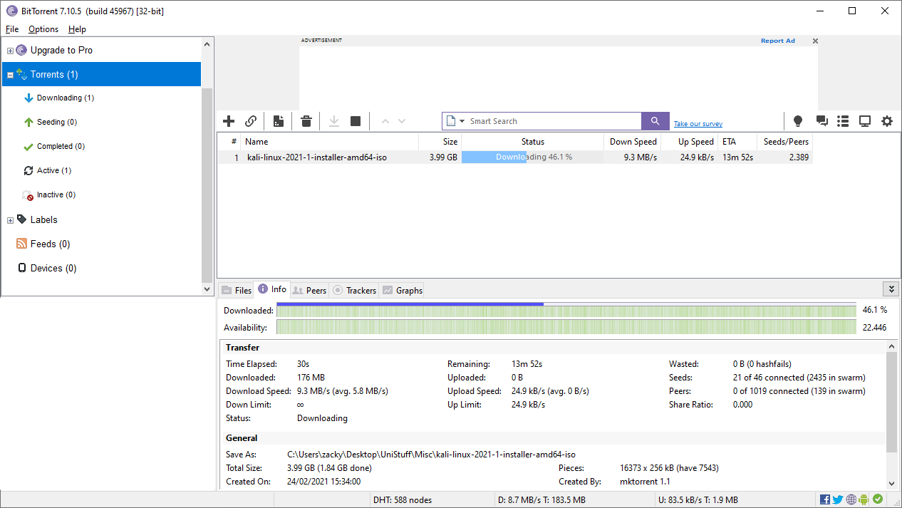

## Step 2. Installing the Kali ISO into the virtualisation software

Once you have the file downloaded and VMWare Workstation/Player open, go to File &gt; New Virtual Machine \(or just press ctrl + n\). Once you've done that, you should be greeted with a configuration wizard that looks something like this:

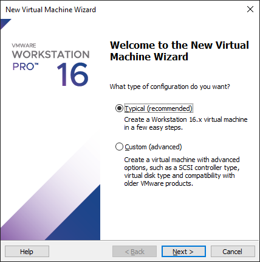

For this installation we will be selecting typical so as to not get bogged down in fine tuning the virtualised hardware of the VM. If this is something that interests you, however, there are other walkthroughs you can use, but I would always recommend experimenting, VMs are free after all so you have nothing to lose but time.

In the next stage of the configuration wizard, you'll be prompted to input the path to the iso file that you installed earlier on, do so, and then hit next.

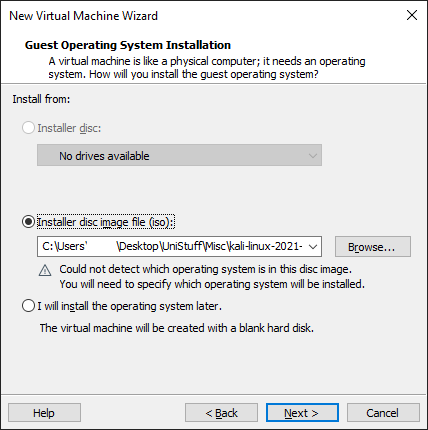

Next you'll be prompted to specify what operating system the iso file is, as Kali is not one of the standard desktop linux operating systems, the software will guess you're using a version of Ubuntu 64-bit, you need to change this using the drop-down menu to whatever the most recent version of Debian is available, as Kali is a Debian-based operating system and works along those lines. Make sure to specify 64 bit if that's the version you're installing.

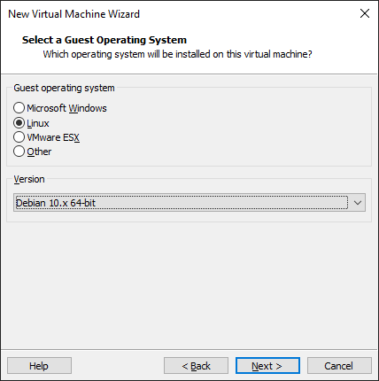

Next you'll need to give the VM a descriptive name, I've done with "Kali-Walkthrough" here, but if this is your first installation, just simply calling it "Kali \(or something along those lines\)" will be fine.

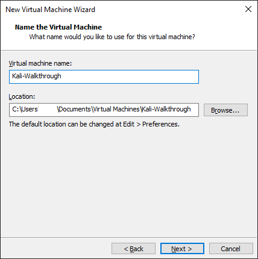

Next you'll be asked to specify the size of the disk you want to use, 20gb is sufficient for the operating system as it is, with a little bit of extra room if required, however if you will be doing work on the machine that requires local file storage then it's probably best to boost that up to 30 or 40gb, depending on your own needs.

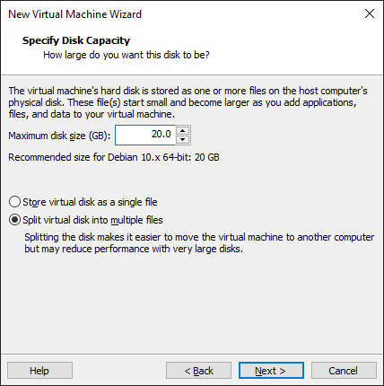

Finally you'll be greeted with this window, which serves as confirmation of all of the information you've put in previously, make sure to look over this page and check everything's correct, and if you're happy with that, hit "finish"

Once you're done you should be shown a page like this, hit the little green play button with the words "Power on this virtual machine" to continue.

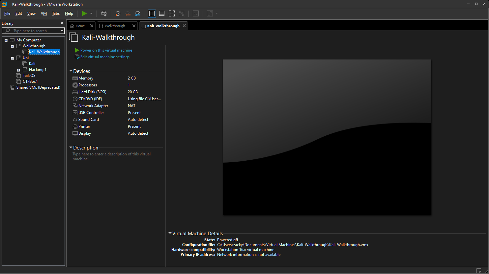

## Step 3.  Installing the OS

Once you've launched the VM, after a few seconds of booting up, you'll be greeted with the following screen:

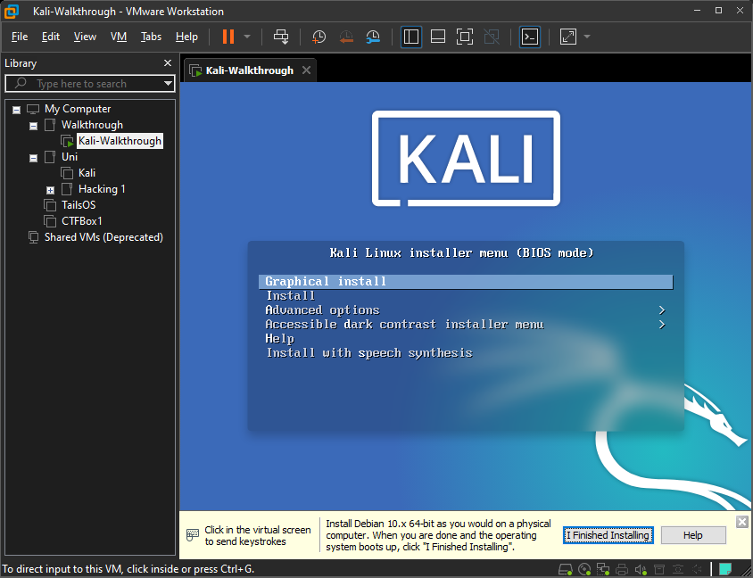

Select "Graphical Install", this will take you firstly to a number of screens that allow you to specify language and keyboard layout, and then the following screens, which asks you for a hostname and domain name, it's ok to keep "kali", as I did in the first screenshot, or to make something up, as I did in the second, you can keep these both as they were, if you like.

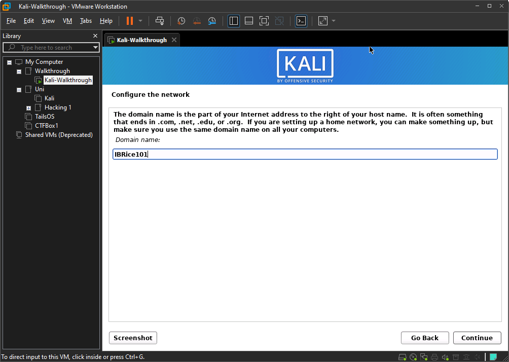

After this will come the personal details, fill these in as you would normally \(first name, username, password, etc\)

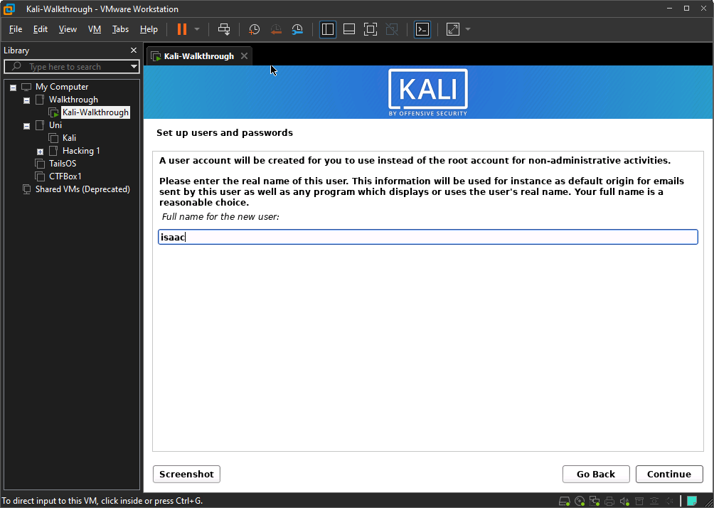

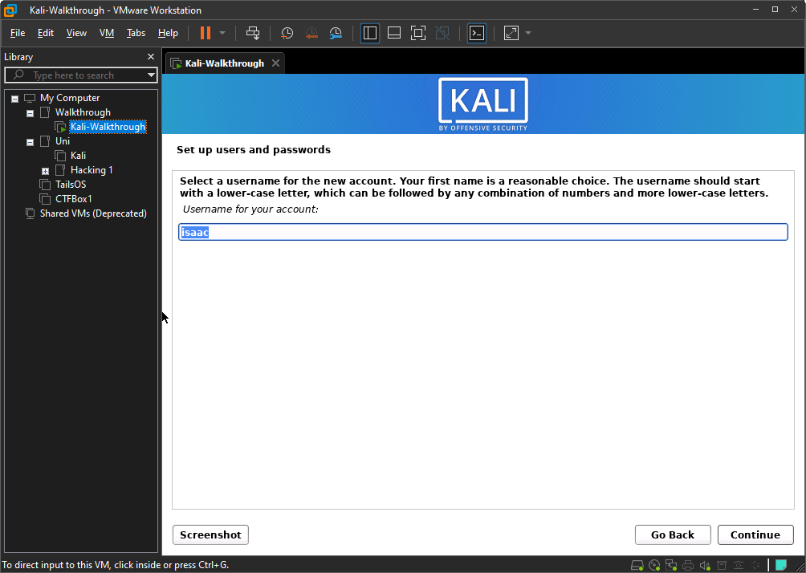

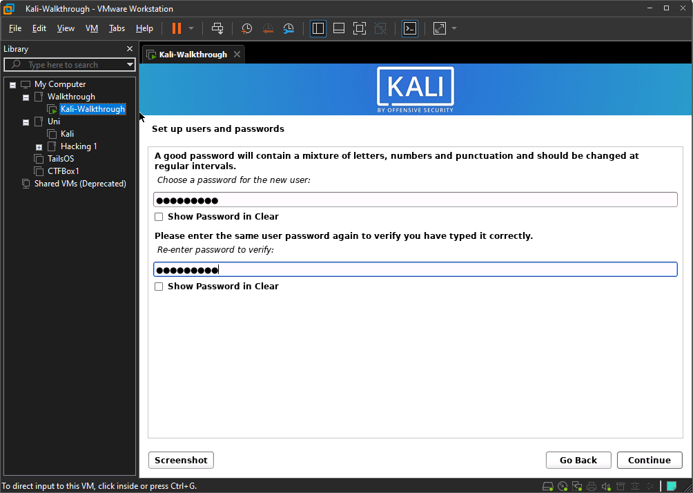

Next, you'll be taken through the disk partitioning phase of the process, select "Guided - use entire disk", so as to avoid any unnecessary hassle when setting up the VM. We won't be dual booting or setting up LVM this time around.

In a fresh VM there should only be one disk available to partition, select that one and continue

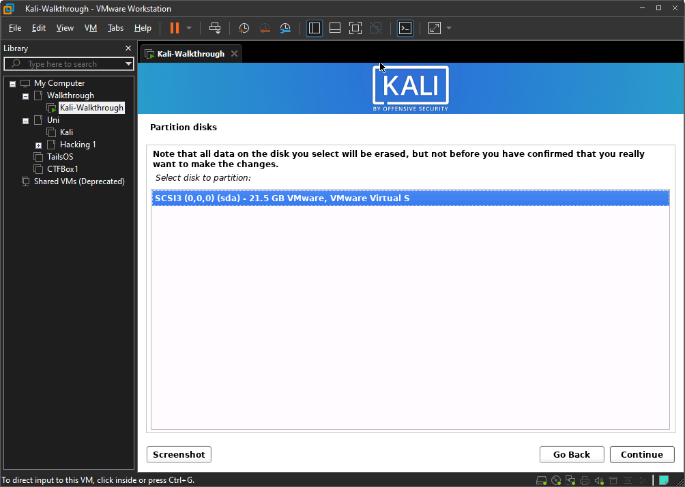

Select "All files in one partition", this is the option that will give new users less trouble down the line.

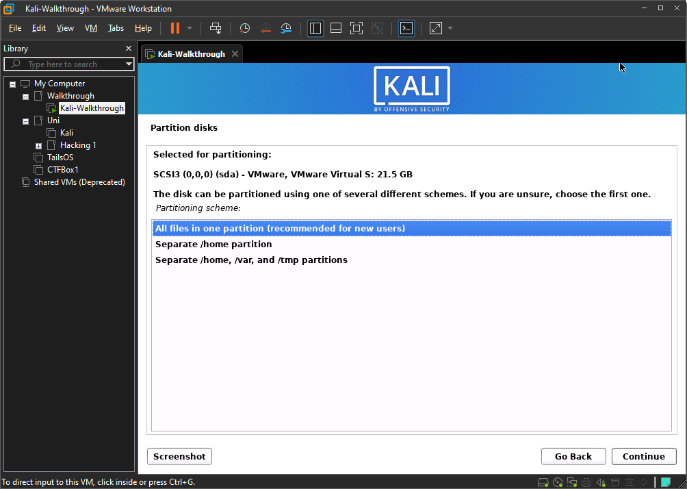

Look over the partition disks page to make sure everything is in order, once you're happy that it is, click finish partitioning and write changes to disk and continue, then when prompted on the next page, click "yes" and continue.

Now comes the part where you get to choose software that comes preinstalled on the operating system. The first thing to settle on is the desktop environment,with the options being XFCE \(the Kali default\), GNOME, and KDE Plasma. This oprion is primarily for aesthtic purposes \(and assorted built in programs etc\). If you don't already have a preference, I recommend selecting XFCE.

After this is the tools. I'd recommend keeping defult settings here as well and installing extra programs as and when you require them, this keeps the size of the VM to a reasonable level whilst also ensuring you have most of the tools you'll need.

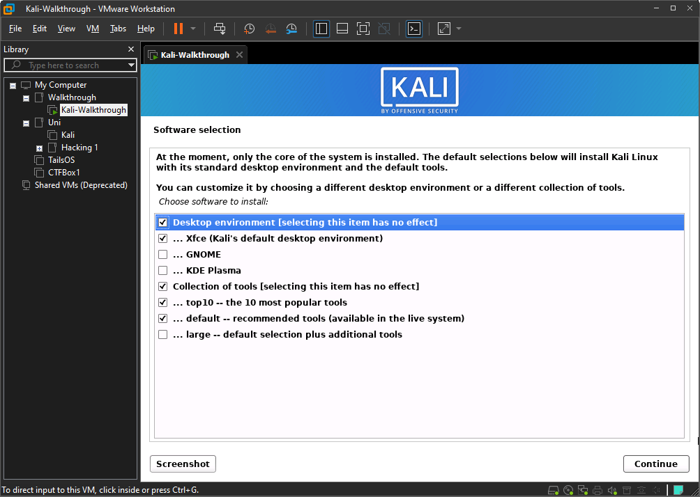

Select "yes" when prompted to install the GRUB bootloader to your primary drive, this program runs as soon as you start the VM up and allows you to select what operting system you would like to boot. Install it to `/dev/sda`, which should be the only option other than "enter device manually"

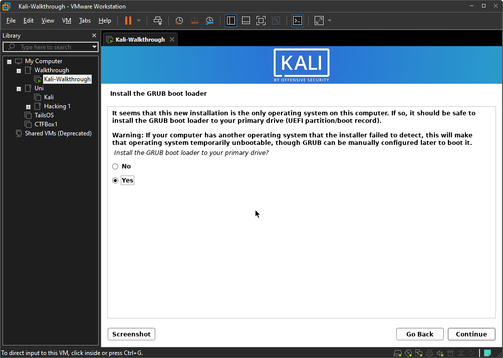

After this, the installation is nearly complete, click "continue" when prompted to finish the installation and then just wait. It'll throw you out to a black screen with scrolling text, don't worry too much about this, it may tell you some things have failed but this is perfectly normal and will not affect the functionality of the OS.

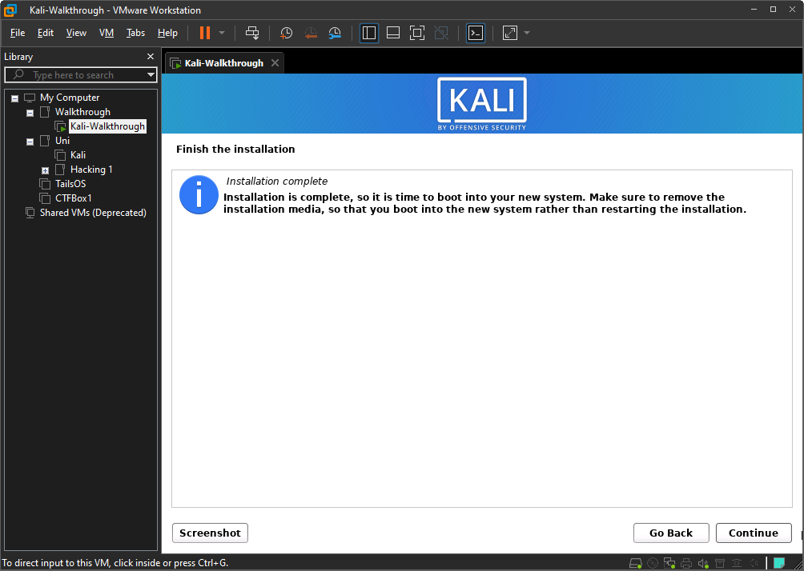

After going through the reboot sequence and past GRUB, you should see this, insert your username and password as before and continue \(root/toor no longer works since Kali switched to non root user as default\).

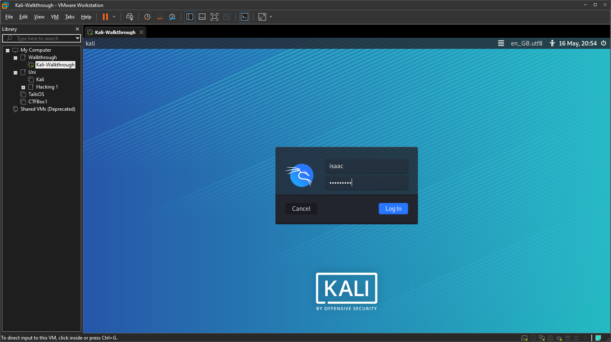

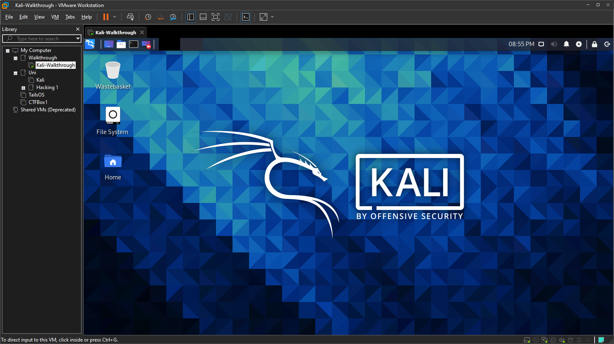

Your installation of Kali is complete, congrats, and happy hacking!!!

