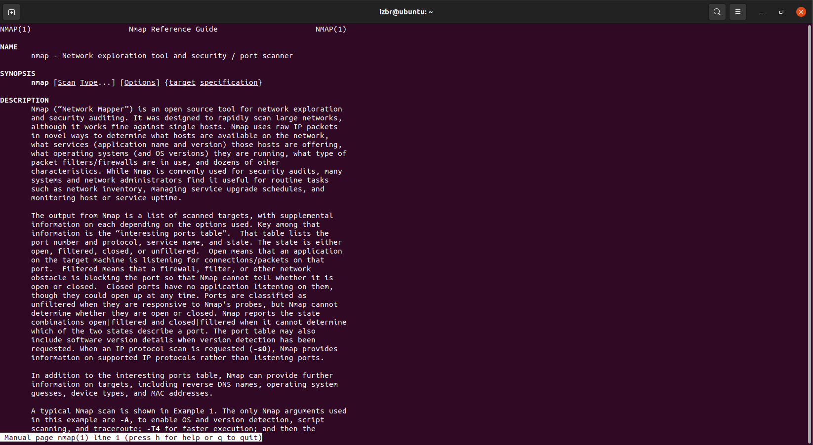
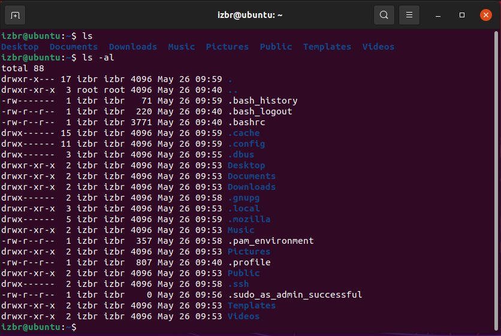
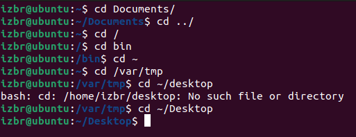
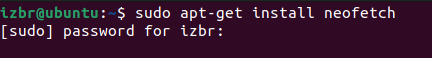
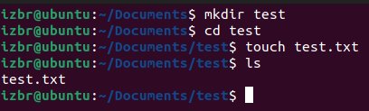
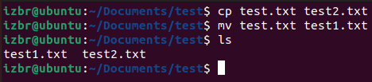

# Linux Commands for Beginners

_By_ [_Isaac_](../../../members/members/isaac.md)

This article will describe some basic commands that you may use on a regular basis in Linux.

## man

One of the most important commands to know as a beginner to Linux, this command returns a manual page for any given command. for example, you could type `man nmap` to return the manual page for the `nmap` tool.

A typical man page will give you the name of the tool, its general usage syntax \(e.g. nmap's is `nmap [Scan Type...] [Options] {target specification}`\), a description of some form \(normally a couple of paragraphs\), and then the remainder of it will normally be options, switches, ways of altering the behaviour of the tool, and example of how to use it.

Typically, if a command doesn't have a `man` page, using the `-h`/`--help` flag allows the user to view some usage info \(such as helpful additional flags etc.\)

## ls

`ls` is a standard Linux tool that allows a user to list information about the files in a certain directory. If used without switches \(simply typing `ls`\), then the program will just list the names of files, subdirectories, and programs in that directory at that time. If used with switches, however, a user can get much more information out of the directory.

Arguably the most common switches to append to `ls` would be `-a` and `-l` \(often grouped together, written as `ls -al` or `ls -la`\). the `-a` switch lists all of the hidden entries \(filenames beginning with a full stop\), and `-l` "uses a long listing format", which includes significantly more information, such as read-write permissions, owner, date and time of creation, and size.

## cd

`cd` stands for change directory, this is the standard navigation command and allows you to traverse your entire filesystem \(provided you have the ability to access it all\).

There are various options you can give it, that can all be used in tandem with one another, for example, starting from the home directory, you can cd into Documents by typing `cd Documents`, then you can return to the home directory either by typing `cd ../` \(with `../` being the option for go out one directory\) or `cd ~`, where `~` is the symbol specifically for the home directory. Additionally you can specify absolute paths from root by beginning your command with `/`, for example `cd /var/tmp` takes you first to root \(symbolised as `/`\), then to the `var` subdirectory, and finally to the `tmp` subdirectory.

\(a little hint: to speed up typing, you can press tab on your keyboard when you've written enough of the word, for example `cd Doc[tab]` will autocomplete to `cd Documents`\)

## sudo

`sudo` \(which stands for SUperuser DO\) is the command you use when you want to perform an action as root, \(known as administrator in Windows\). Most of the time this command will be used when making changes to your system, such as installing a new piece of software or editing a config file.

## mkdir and touch

`mkdir` creates a new directory, and `touch` creates a new file.

## cp and mv

`cp` copies a file from one location to another, and `mv` moves it. `mv` also has the secondary function of renaming a file if the file path specified is the same as the current location of the file in question.

## grep

## awk

## sed

## less and more

## \| \(pipe\)

## xargs

## test

## time

