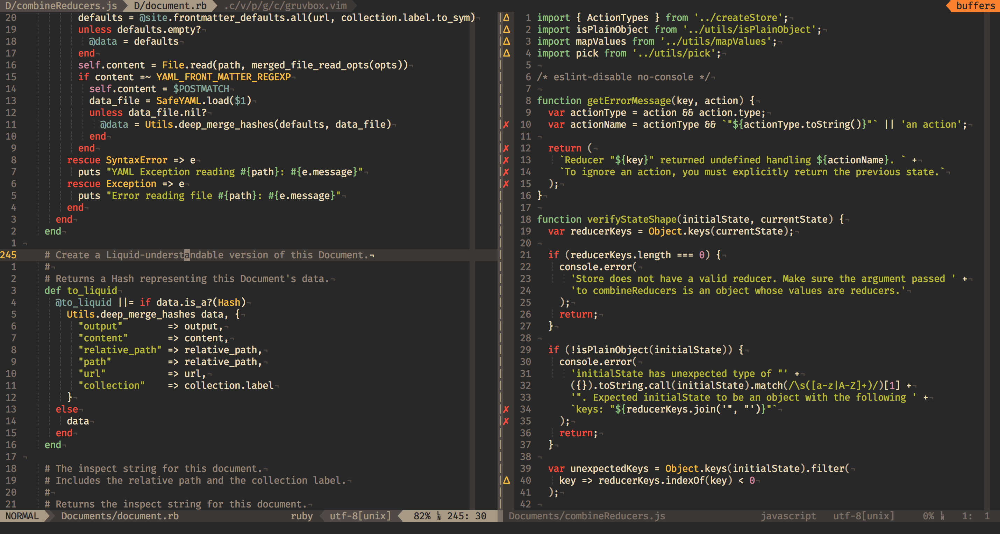

# Vim

*By [Isaac](../../../members/isaac.md)*



Vim is an open-source, terminal based text editor originally released in 1991 by Dutch programmer Bram Molenaar. It is an improvement on Bill Joy's original vi text editor (hence the name vim, standing for vi iMproved), which was originally published in 1976 for some essentially prehistoric computer systems.

Its wide availability and extensive customisability, on top of the efficiency the program affords makes it one of the most popular and most preferred text editors by many amateur and professional programmers.

## Why use Vim?

1. Wide availability

   Vim, and its predecessor vi, is pretty much ubiquitous across all Unix based systems. Essentially it's possible to access any Unix terminal anywhere in the world, (including over SSH which is a big benefit for CLI text editors), and be pretty confident that the vi/vim text editors will be on there so you can start editing straight away. 

   As hackers this is really important, as in the course of our work it's often important to access many different machines and edit text on them, having a constant like vi/vim is really nice. 

2. Great documentation and a fantastic community

   For reasons you'll see in a moment, Vim needs quite a lot of documentation to support its use. Thankfully though, the Vim community has collectively made countless wiki articles, cheat sheets, walkthroughs, stack exchange posts, and official website/repo commits to assist you in your journey through the world of vim. Any query you could have is just a few seconds away from being answered thanks to the community.

   The community is also responsible for an absolute ton of fantastic plugins and addons, which we'll talk about next.

3. Customisability

   Through the usage of the `vimrc` config file (examples at the bottom of this page), you can customise Vim to your absolute heart's content. You can change colour schemes, remap key bindings, add plugins that allow you to do essentially anything you could do in an IDE, configure tabs and whitespace, and so much more. You really can do anything with Vim and enough time.

4. Efficiency

   This is the big one, and the main reason that most people can be such Vim evangelists. In most text editors, you're thrown into the editor able to write to the buffer immediately, this is brilliant if you're editing a long stream of text and not going back to edit it much (like writing a report or something), but not so great when writing code. In code you often have to edit single lines at a time and quickly jump to other lines in other parts of the document, Vim makes this process much quicker and easier by removing the mouse from the equation and making you edit using keystrokes without straying too far from the home row (starting asdf). 

   "How does this work?" you may ask, well, Vim is a modal editor, meaning there are several distinct modes you can put the editor in, including "Insert" (`i`), which is what you'd expect from a text editor, "Visual" (`v`), which highlights blocks of text,  and "Normal" (`Esc`), which allows you to navigate the document.

   [This article](https://betterprogramming.pub/understanding-the-efficiency-of-vim-d6a5ab8feb2d) on the efficiency of Vim is a great introduction. TL;DR: you're able to send commands (like `dd` which deletes a line), repeat the commands by adding a number (`d10d` deletes 10 lines)

## How to learn

You may be thinking this is all very complicated, and you'd be right. The skill ceiling for Vim is famously high, but when you get the hang of it it becomes second nature and improves workflow massively. How do you start learning though?

Helpfully, when you install the Vim package, it comes bundled with a program called `vimtutor`,  this program resembles a vim text file and walks you through editing itself in the same way you'd edit a text file in Vim. Once you complete it you should have a rudimentary grasp on the editor.

## Some Basics

With thanks to David Rayner and his [Best Vim Tips](https://vim.fandom.com/wiki/Best_Vim_Tips) article on the Vim wiki (recommended skim).

```
<Esc> is the escape key or use <ctrl>[  sometimes written as  <C-[>

vimtutor    : starts vim editing a copy of a tutorial file -- very good.
i           : insert mode. Next keys typed are inserted into the file.
<Esc>       : Escape from insert mode so you can navigate and use edit commands (stop selecting)
h j k l     : move cursor ( h: ←  j: ↓  k: ↑  l: → )
A           : Append at end of line
o           : Insert at new line below
u           : undo last command, again and again
x           : delete character under cursor
dw          : delete everything right from the cursor to the start of next word (and put it into the default register)
dd          : delete line (and put it into the default register)
p           : paste the default register

/myname     : search forward for myname

:wq         : write and quit
:x          : write and quit
:w filename : write a copy of the file you are editing as filename
:q!         : quit without saving even if changes were made!
:help       : display help
<Tab>       : use tab completion to scroll through commands that start with what you typed

COPY PASTE  (for CUTting lines use dd as described above)
v           : visual mode -- use to select text with cursor movement or mouse
y           : use to yank (copy) what was selected
<Esc>       : esc gets you back to the main mode

^ w e $     : bigger movements: beginning of line, word, end of word, end of line

Modes:
 normal, insert and visual, there are others too
 <Esc>    takes you back to normal

Enter a number before a command to repeat it, examples:
   10w      : skip forward 10 words
   10dd     : delete 10 lines

Commands are case sensitive:
   c        : starts a change command
   C        : change to end of line (same as c$)
   ce       : change to end of word (a complete change command)
```

## Further Reading

- [The Vim Website](https://www.vim.org/)
- [Vim's Man page](https://linux.die.net/man/1/vim)
- [Vi/Vim stack exchange](https://vi.stackexchange.com/)
- [Vimawesome](https://vimawesome.com/) (plugin site)
- [Cheat sheet](https://vim.rtorr.com/)
- [Best Vim Tips](https://vim.fandom.com/wiki/Best_Vim_Tips)

## Various vimrcs (configs)

### Isaac's vimrc

To use this `vimrc` file you'll need to install [Vundle](https://github.com/VundleVim/Vundle.vim) and [Gruvbox](https://github.com/morhetz/gruvbox).

```vimscript
set nocompatible              " be iMproved, required
filetype off                  " required

" set the runtime path to include Vundle and initialize
set rtp+=~/.vim/bundle/Vundle.vim
call vundle#begin()

" let Vundle manage Vundle, required
Plugin 'VundleVim/Vundle.vim'

" plugins from vimawesome.com "
" git wrapper
Plugin 'tpope/vim-fugitive'
" filesystem explorer
Plugin 'scrooloose/nerdtree'
" syntax checking
Plugin 'scrooloose/syntastic'

" All of your Plugins must be added before the following line
call vundle#end()            " required
filetype plugin indent on    " required

" colour scheme "
" packadd! dracula
syntax enable
colorscheme gruvbox

" tabs are 4 spaces "
set tabstop=4

" numbering "
set number
set relativenumber

" automatically indent "
set autoindent

" spell check for markdown and txt files "
autocmd BufRead,BufNewFile *.md setlocal spell spelllang=en_gb
autocmd BufRead,BufNewFile *.txt setlocal spell spelllang=en_gb

" search as characters are entered "
set incsearch
" highlight matched characters "
set hlsearch
" Ignore case when searching "
set ignorecase

" shows an autocomplete menu when typing a command "
set wildmenu
set wildignorecase "ignorecase autocomplete

" display ruler on bottom right "
set ruler

" auto updates file if external source edits the file "
set autoread

" improves performance by only redrawing screen when required "
set lazyredraw

" plugins (found at vimawesome.com) "
Plugin 'tpope/vimfugitive' # git wrapper
Plugin 'scrooloose/nerdtree' # filesystem explorer
Plugin 'scrooloose/syntastic' # syntax checking
```

### Sam's vimrc

```vimscript
"        _
" __   _(_)_ __ ___  _ __ ___  
" \ \ / / | '_ ` _ \| '__/ __| 
"  \ V /| | | | | | | | | (__  
" (_)_/ |_|_| |_| |_|_|  \___| 
"

" basic sensible defaults
    set nocompatible
    filetype off
    syntax on
    set encoding=utf-8
    set backspace=2
    set number relativenumber

    " show commands as ur typing them 
    set showcmd
    " jump to matching bracket briefly on insert
    set showmatch
    " dont redraw during macros, runs them faster
    set lazyredraw

" tabs
    " always use 4 spaces as tab
    set expandtab
    set tabstop=4
    set softtabstop=4
    set shiftwidth=4

" searching
    " highlight incrementally
    set incsearch
    " highlight results
    set hlsearch
    " no capitals searches case insensitive, caps are
    set smartcase ignorecase

    nnoremap <silent> <Space> :nohlsearch<Bar>:echo<CR>

" window navigation
    nmap <C-H> <C-W>h
    nmap <C-J> <C-W>j
    nmap <C-K> <C-W>k
    nmap <C-L> <C-W>l

" buffer navigation
    nmap <silent> <C-N> :bn<CR>
    nmap <silent> <C-P> :bp<CR>

" file browsing
    " no banner
    let g:netrw_banner = 0
    " open file in previous window
    let g:netrw_browse_split = 4
    " 25% width
    let g:netrw_winsize = 25
    " for quick edits, open the file in sensible places
    let g:netrw_altv = 1
    let g:netrw_alto = 1

    map <silent> <C-E> :Lexplore<CR>

" folding
    set foldenable
    set foldlevelstart=10
    set foldmethod=indent

" autocompletion 
    set wildmenu
    set completeopt=preview
    set wildmode=longest,list,full

" hex editing
    " bind command for calling hex mode function
    command -bar Hexmode call ToggleHex()
    
    " hex editing toggle function
    function ToggleHex()
        if !exists("b:editingHex") || !b:editingHex
            " set status
            let b:editingHex=1
            " switch to hex editor
            %!xxd
        else
            " set status
            let b:editingHex=0
            " switch to hex editor
            %!xxd -r
        endif
    endfunction
    
    " bind ctrl+B to toggle hex mode in 
    nnoremap <C-B> :Hexmode<CR>
    inoremap <C-B> <Esc>:Hexmode<CR>
    vnoremap <C-B> :<C-U>Hexmode<CR>
```


