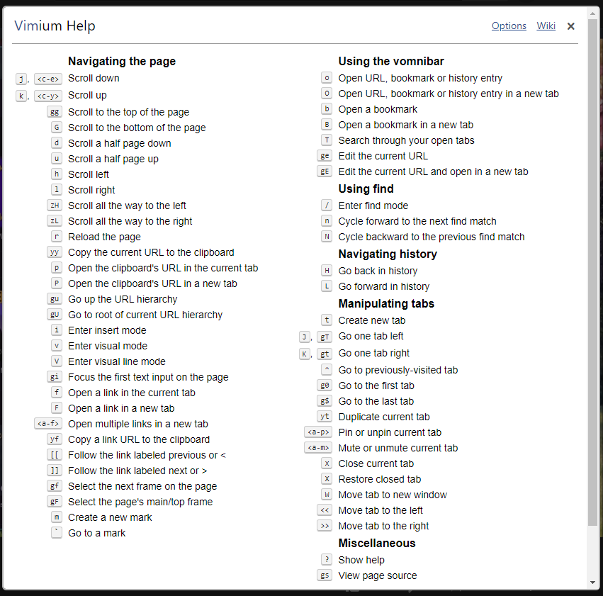
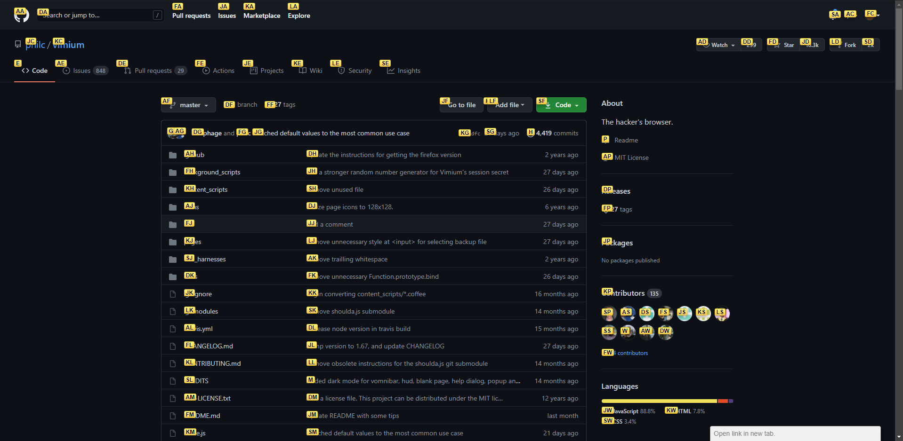
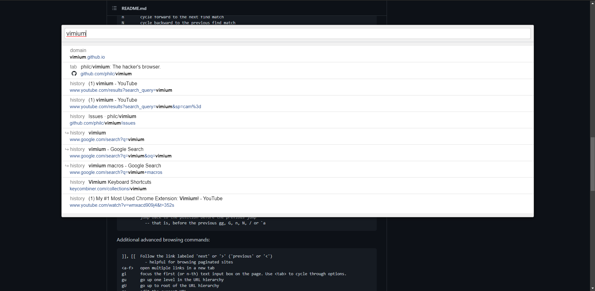
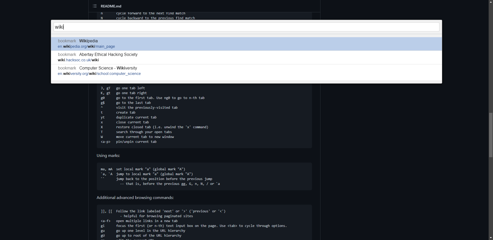

# Vimium

_By_ [_Isaac_](../../../members/members/isaac.md)

[Vimium](https://vimium.github.io/) is a web browser extension available for Chrome-based browsers and Firefox that allows users to make use of Vim-like keybindings for navigating the internet.

## Benefits of Vimium

The primary benefit of using the Vimium extension is an increase in user efficiency, a task that would, for example, entail clicking the address bar, typing in a search term, hitting enter, then clicking an address and navigating by mouse in the target site results in a relatively inefficient workflow due to two main factors:

1. The introduction of inaccuracies, the possibility of clicking a wrong link by mistake and having to go back to try again, which is made worse by...
2. The speed at which you can reasonably click things. Using the mouse for most tasks introduces a speed ceiling. Targeting things accurately at any serious speed is a skill that even the most experienced CS:GO players can struggle with from time to time, keyboard input is much more reliable for most things.

In addition to this, Vimium can also massively improve Vim competency, before beginning to use the extension in my browser I made use of the arrow keys on my keyboard for simple character based navigation in vim, however once I began to use Vimium, by necessity, I started to use `hjkl` for navigation, as that \(and their `shift` variants\) are the primary way of navigation in-browser \(`shift-H` and `shift-L` for example switch between tabs\), keeping your hands on the home row is a key part of why Vim can be such a useful editor

Important note: enabling Vimium does not disable mouse input, at any time you can return to standard browser navigation without having to uninstall the extension, handy!

## Quickstart Guide

After installation, users can press `?` when in normal mode to bring up a list of default commands at any point, like so:

### Link Navigation

By far the most common keypress you're likely to use is `f`, this button brings up a series of further keypresses over links in order for you to click them, like so:

Users can also navigate to other sites in Vimium using what's called the "Vomnibar", this is done by typing either `o` for a generic search \(using either your default browser or a url\), and `b` to access certain bookmarks.

As with all commands that allow users to navigate to another link, combining this command with `shift` will open the selected link in a new tab.

### Tab and History Navigation

To navigate history \(going back and forwards in a tab\) the keys are `shift-H` and `shift-L`, with navigating between tabs being `shift-J` and `shift-K`, eagle eyed amongst you will notice that these are the same keys that are used to navigate in a single page in vimium, or in a document in Vim, but shifted, this is no mistake, as its designed to keep your fingers on the home row, as discussed earlier.

Opening a new tab is dont with `t`, warning: this will automatically put you in insert mode in the search bar, so attempting to run commands on the home page will require you to press `Esc` first. Browsing through currently open tabs, however, can be done with `shift-T`, which is a lifesaver for people with dual monitor setups \(such as myself\) with instances of the browser on each monitor with different purposes, it prevents you having to click on another monitor to target it.

Closing the current tab can be achieved with `x`, with `shift-X` reopening the most recently closed tab \(like `ctrl+shift-T` in Chromium\)

Further specific navigation bindings are available at the github \(linked below\), or in the image above.

## Further Reading

* [The Vimium GitHub page](https://github.com/philc/vimium)
* [The Hacksoc Wiki article on Vim](vim.md)
* Videos:
  * [My \#1 Most Used Chrome Extension: Vimium! - Better Dev](https://www.youtube.com/watch?v=wMxAcD909j4)
  * [Vim Life Ep 3: Vimium : Intro to using keyboard in your browser - ThePrimeagen](https://www.youtube.com/watch?v=cA2aUFsSLac)
  * [Improve Efficiency In Chrome or Firefox With Vimium](https://www.youtube.com/watch?v=bSdLfN03g-g)

