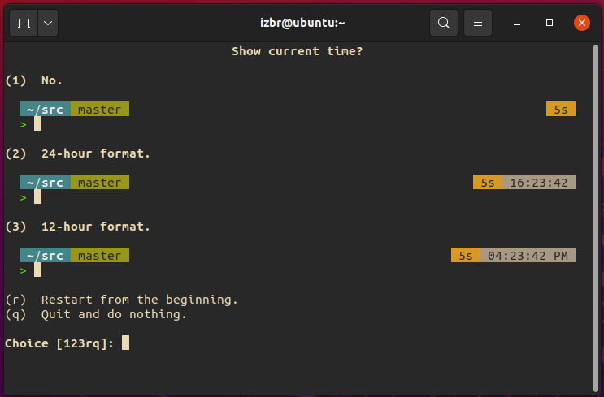

# Zsh

_By_ [_Isaac_](broken-reference)


the Z shell, often called Zsh, is a Unix shell, (a program that works as a text-based interface between a user and a computer) based heavily on the Bourne Shell (`sh`), and the Bourne Again shell (`bash`). This article will give an introduction to the shell, explain the benefits of it, and then walkthrough the installation and configuration procedure.

## Benefits of Zsh

Zsh is functionally Bash++ in many respects. Essentially all of the features one may be comfortable with in Bash (the standard shell on most Linux distributions) are preserved in Zsh, which allows for ease of adjustment. Where Zsh shines, however, is in the additions on top of Bash, a few of which follow.

Both Bash and Zsh use tab autocomplete when typing certain commands (such as `cd`), but Zsh's tab completion gives a navigable menu of options to choose options from. For example, a user could type `cd D` and hit tab. In Bash you will get no response until they type enough text for the shell to be able to determine whether they meant `Desktop` or `Documents`, whereas in Zsh both options will appear below the input line and the user can choose which one they want. This applies to all files, so you can type a string of letters, hit tab, and receive a menu full of items ranging from directories to programs to miscellaneous files.


Speaking of `cd`, in Zsh, you don't even _need_ to type it! You can, of course, if you want, but simply typing the name of a directory (including inbuilt directory aliases like `~` for home and `/` for root) will allow the user to navigate there. Zsh also has recursive path expansion, so a user can type `/u/lo/b` and have that expand to `/usr/local/bin` and cd into that directory, it also has spelling correction and approximate completion, meaning if you accidentally type `Docunents` it will correct to `Documents` for you.

However, by far the greatest Improvement on other shells that Zsh has to offer are the plugins and community based features, if there's only one reason to get Zsh it's this.

The open-source, community-based "[oh my zsh](https://ohmyz.sh/)" project serves as a framework for an absolute plethora of plugins and themes. Including, but not limited to `autopep8` which automatically formats python code to pep8 standard, `colored-man-pages` which does what it says on the tin, `git`, which provides an array of aliases for git commands, and `sudo`, which prefixes current or previous commands with `sudo` by pressing escape twice. In addition there is a series of plugins that offer support for popular scripting languages, such as python and golang.

## Installation

To go through the installation and configuration of Zsh, you must first run this command (assuming you're running a Debian based system, if not install the zsh package however you would in your package manager):

```
sudo apt-get install zsh
```

Then simply make it your default shell by inputting the following command:

```
chsh -s $(which zsh); reboot
```

A little note: this command is a bit interesting because we're actually running three commands here, `$(which zsh)` stores the output of the `which zsh` command in a variable, on which the chsh -s command is run, immediately followed by a semicolon, the symbol for separated commands in most languages (including bash script), and then `reboot`. Interesting stuff! (at least to me, a nerd lol)

## Base Configuration

Now you've rebooted you should be greeted with a terminal that looks something like this:


An important note is that from here on in, configuration is entirely optional. It is possible to keep everything stock, however for reasons you may see in a moment that isn't exactly ideal. The remainder of this walkthrough section will be just one way of configuring the Z shell, at any point you can make different choices, whatever is right for you and makes things look how you want is the right way to configure it, this is just walking through the menus :).

After pressing 1 (the config main menu option) we're greeted with this main menu, we will be entering each of the top three config options so as to have as granular control over the setup as possible without having to hand write an entire `.zshrc`.


First we come to the history configuration menu. Another feature of Zsh is the history feature, where the last \[HISTSIZE] number of commands that a user has written will be saved, so that if the command needs to be run again it can be accessed quickly on the terminal itself, this can be made even more efficient by an oh my zsh plugin called `zsh-autocomplete` that accesses the history dotfile. I'll be leaving this the default size of 1000 and in the default installation location, the home dir.


Next, the completion system config page. This system, as the page says, "allows you to complete commands, arguments, and special shell syntax such as variables". the compsys, as it's called, is one of the main attractions of zsh in my view, and as a result is worth the slight increase in startup time that it affords upon opening.


After this comes the Default editing configuration, wherein we can choose between an emacs-style constant stream of editing into the buffer, or a vi/vim style modular approach to editing. My personal preference in shell line editing is a constant stream into the buffer and as such I will keep it "emacs style" (however when it comes to the editor wars, vim all the way baby!)


And then that's it! You've officially switched to Zsh! you can stop here, if you wish, however a downside (if you can call it that) of zsh is that in its stock, out-of-the-box state, it's pretty ugly and relatively featureless, you _can_ do whatever you like on here... bu tit's a matter of whether you _want_ to. Because of this, the next section will be on customisation, making the Z shell look pretty.


## Addons and Plugins (Making it look nice and feel nicer)

The very first place any Zsh customisation journey _has_ to start is by adding oh my zsh, the plugin manager and shell framework that was mentioned earlier in the article. You can get oh my zsh by running the following command:

```
sh -c "$(curl -fsSL https://raw.githubusercontent.com/ohmyzsh/ohmyzsh/master/tools/install.sh)"
```

As soon as that has finished running, you should be shown this screen:


The improvement is immediately noticeable, the line editor bar tells you where you are in the filesystem instead of just the operating system followed by a % symbol (that's what that little \~ is in case you didn't know, represents the home directory). But we can, and indeed should, go further.

The [oh my zsh github page](https://github.com/ohmyzsh/ohmyzsh) makes very clear the fact that they offer _both_ themes and plugins, however my personal preference is for an external theme that we'll come on to in a second, so let' stalk about plugins first and foremost.

In order to add plugins to zsh through here, all we have to do is open the `.zshrc` config dotfile with our favoured text editor (vim), find where it says `plugins=`, and begin adding them, like so:


Now we move on to the theme, and really there's only one choice of zsh theme, and that is [powerlevel10k](https://github.com/romkatv/powerlevel10k), take one look at the screenshots from the github repo and tell me that that isn't the best looking, most customisable option out there for shells. I bet you won't be able to. In particular I like the full `pwd` style file path display and the timer that shows how long it took for a program to execute.

We can install p10k using the oh my zsh manager and the following command:

```
git clone --depth=1 https://github.com/romkatv/powerlevel10k.git ${ZSH_CUSTOM:-$HOME/.oh-my-zsh/custom}/themes/powerlevel10k
```

after acquiring it we change the theme from "robbyrussell" to "powerlevel10k/powerlevel10k" in the .zshrc, then reboot, and then we'll be taken into the configuration menu on next terminal startup, like so:


Answer all of the questions as posed to you in the wizard, this is intended to determine what styling your terminal has and adjust itself accordingly so the rendering of the text and other artefacts are as good as possible.

Now we come on to aesthetics, so firstly we choose what colour scheme we want, I personally prefer "rainbow" in this case so I'll choose this, option 3 (remember, all of these options can be changed later in the corresponding dotfile)


Next we decide whether we want a current time option for when the prompt shows up, I would personally like one, and I prefer the 24h clock design, so I'll be choosing option 2.



Next we choose either one line or two, I prefer having as much space as possible on the line I'm writing on, so 2 lines it is.


I think prompt connection looks bad, so no connection here.


To keep things comfortably readable, I think keeping blocks far enough away from eachother is most appropriate, so sparse prompt spacing is my preferred option.


Conciseness is ideal for me in terms of flow.


And I like a transient prompt to show in no uncertain terms where we are in the page at that moment.


Next we come to instant prompt, this feature allows for plugins to be quietly loaded in in the background and the line editor bar to be loaded in instantly so users can begin using their terminal instantly, this is a no-brainer for me, and should be for anyone else who intends to use a significant number of plugins


Finally comes the option to save to the .zshrc file, which will permanently save your options (intil you come along and edit them agian of course). Once you're happy with everything you've dobe, hit y, and you'll be thrown into the final form of the shell.


